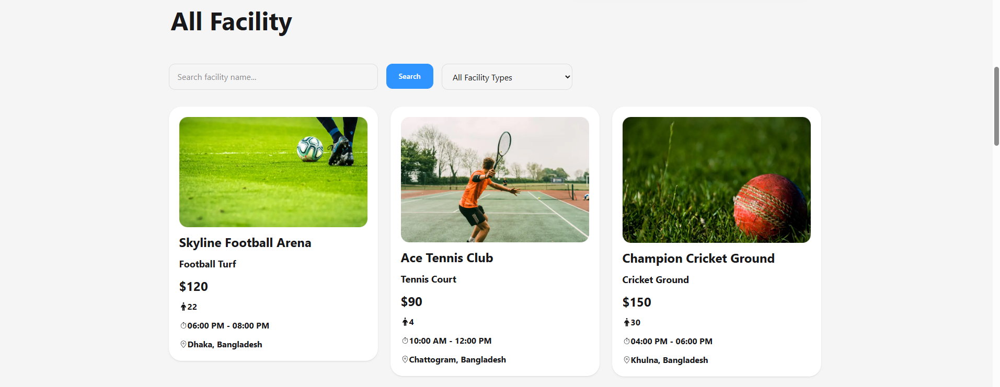

# 🚀 Assignment-009 (Turfi)
This is a backend server built with **Node.js, Express, MongoDB, and JWT Authentication**.  
It provides secure APIs for authentication, booking system, and facility management.

## 📌 Features 
- 🔐 Authentication (Login / Register)
- 🗂️ User-based Booking System
- 🏟️ Facility Management APIs
- 📦 MongoDB Database Integration
- 🌐 CORS Enabled for Frontend Integration
- ☁️ Ready for Vercel Deployment

## 🛠️ Tech Stack
- Node.js
- Express.js
- MongoDB (Native Driver)
- JWT (jsonwebtoken / jose)
- dotenv
- cors

